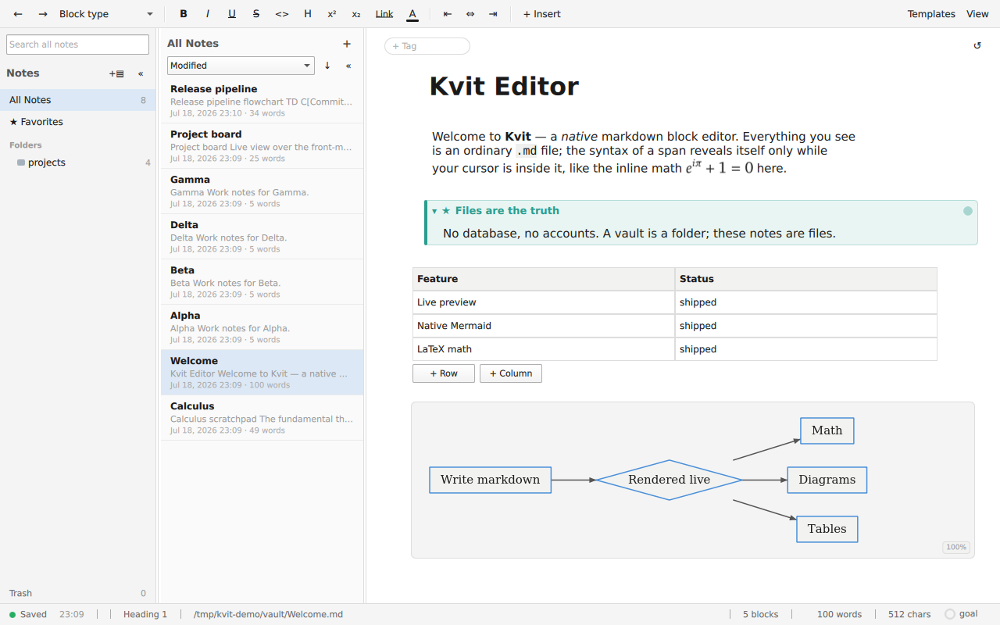
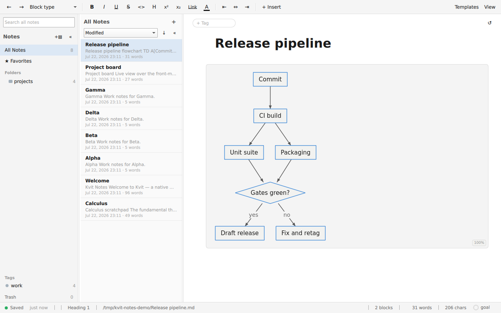
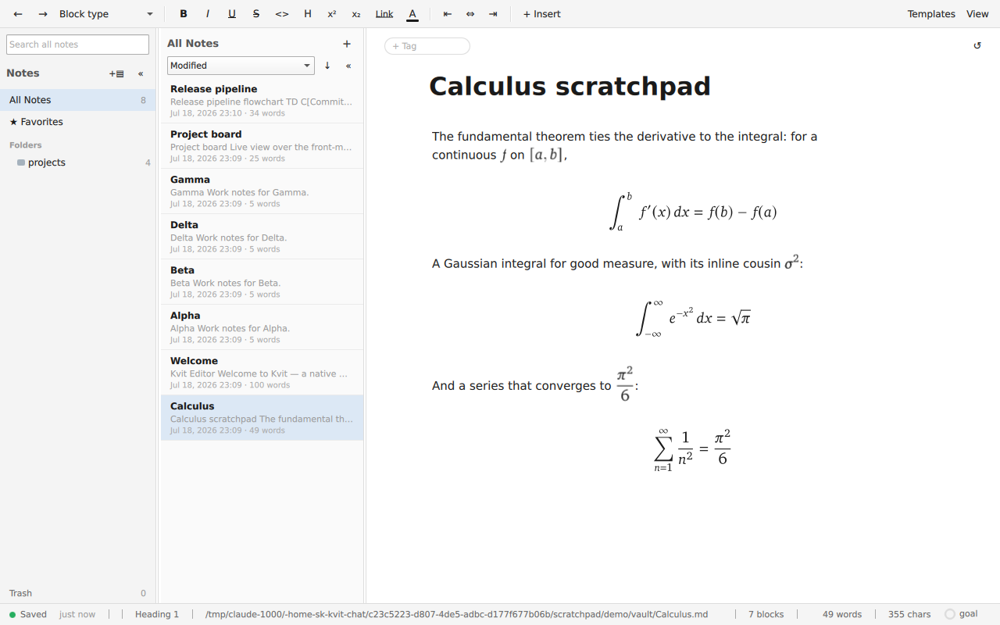
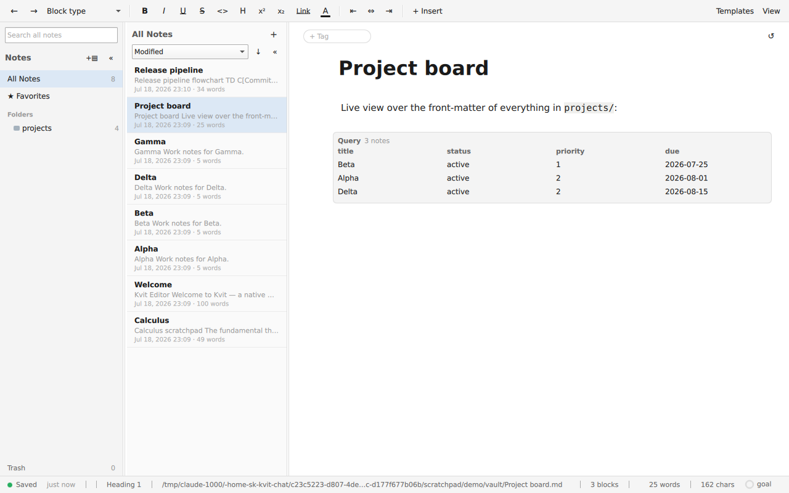

# Kvit Notes

[](https://github.com/kvit-s/kvit-notes/actions/workflows/ci.yml)
[](https://github.com/kvit-s/kvit-notes/releases/latest)
[](LICENSE)

Kvit Notes is a native markdown block editor and notes app: your notes are
plain `.md` files on disk, shown fully rendered, with the raw syntax of a
span revealed only while your cursor is inside it.



## Download

| Platform | Install |
|---|---|
| Linux | [AppImage](https://github.com/kvit-s/kvit-notes/releases/latest) · AUR `kvit-notes-bin` |

**Windows and macOS builds are not published yet.** Both ports compile and
pass the full unit suite in CI on every commit, and the Windows port also
passes it locally against MSVC 2022, but neither has a packaging job: there
is no installer, portable zip, DMG, signing or notarization step in the
release workflow, so a tag produces the Linux AppImage and nothing else.
Building from source works on all three platforms today (see below). This
section lists only what a release actually publishes, and will grow when
those jobs exist.

Flathub and the Homebrew tap are likewise not live yet. The Flatpak manifest
lives at `packaging/flatpak/org.kvit.Notes.yaml` and is submitted by hand;
until that submission is accepted, the AppImage and the AUR package are the
Linux options.

## What it does

- **Live-preview editing.** Text is stored as markdown and rendered in
  place; `**bold**`, `` `code` ``, and link syntax appear only while the
  cursor is inside the span.
- **Native Mermaid diagrams.** Five families (flowchart, sequence, class,
  state, ER) parsed and laid out in C++, no browser engine. Drag a node
  and the markdown source rewrites itself. Pasted ASCII diagrams are
  detected and straightened, and any rendered diagram copies back out as
  text.
  
- **Math.** Inline `$x^2$` and display equations render through a vendored
  MicroTeX with NewTX/XCharter faces, with a command palette on `\` and
  auto-paired dollars.
  
- **The full block palette.** Headings, nested lists and todos, quotes,
  syntax-highlighted code, tables, kanban boards, callouts, toggles,
  images with effects, audio/video, embed cards, drop caps. Everything is
  discoverable from the `/` menu.
- **A notes collection.** Folders, tags, pinning, global full-text search,
  `[[wiki-links]]` with completion and backlinks, a quick switcher, and
  live query blocks that build tables and boards from note front-matter.
  
- **Single-file mode.** `kvit-notes note.md` opens one file instantly
  with no vault and the whole editor intact.

The full manual is [usage.md](usage.md); the product specification is
[features.md](features.md).

## Why Kvit

- **Native C++/Qt.** One process, no Electron, no embedded browser.
  A 561k-word document loads in tens of milliseconds and scrolls at
  ~15 ms frames through delegate virtualization.
- **Markdown fidelity.** Files round-trip byte-for-byte; front-matter
  written by other tools survives untouched. A note written in Kvit opens
  correctly anywhere else, and vice versa.
- **Agent-friendly.** Markdown written by LLM tools is normalized on load
  (with a `.bak` seatbelt), and external edits to open files surface as a
  keep-mine/load-theirs banner instead of silent clobbering.
- **Files as truth.** No database, no accounts, no sync service. Folders
  are directories; a "vault" is an ordinary folder of `.md` files.

## Privacy

There is no telemetry of any kind, and opening a note never contacts
anything. A note can name any address in a link preview, an image, or an
embedded video, and fetching one on sight would tell that site you opened
the note, when, and from what address. So nothing remote loads until you
ask for it: previews, remote images and remote media render as inert cards
with a Load button, and the site you approve is remembered for next time.
Settings → General lists how many sites you have approved, forgets them in
one click, and offers a switch that loads remote content automatically if
you would rather work that way.

Two requests do not need per-site approval:

- **The update check**, if you leave it on: one GET to the GitHub Releases
  API at startup, at most once per day, to show a passive notice when a
  newer version exists. Settings → General turns it off.
- **Content you approved earlier**, which loads without asking again.

Every request the app makes, approved or not, goes through one policy
that restricts it to http and https, refuses URLs carrying credentials,
resolves the hostname and rejects loopback, private, link-local and cloud
metadata addresses before connecting, re-checks each redirect the same way,
and abandons a response that exceeds its size limit or arrives with the
wrong content type.

## Building from source

Requirements: Qt 6.10+, CMake 3.21+, and a C++20 compiler (GCC 12+,
MSVC 2022, or a recent AppleClang). Math rendering is vendored; no system
math library is needed.

```bash
export QT_ROOT_DIR=~/Qt/6.10.1/gcc_64      # your Qt kit
cmake --preset linux-release               # or windows-msvc-release / macos-release
cmake --build --preset linux-release -j
./build-linux-release/kvit-notes
```

On Linux, `./build.sh` wraps configure, build, and the test suite
(`--run` launches the editor). Run the merge-gate tests with
`ctest --preset unit-linux`; see [CONTRIBUTING.md](CONTRIBUTING.md) for
the full suite layout and the UI-test display policy.

Startup modes: no argument opens (and first seeds) `~/Documents/Kvit`; a
directory argument opens that folder as the notes root; a file argument
opens the lone file with no vault.

On Linux, emoji render as empty boxes unless a color-emoji font is
installed: `sudo apt install fonts-noto-color-emoji && fc-cache -f`.

## License

Kvit Notes is released under the [Mozilla Public License 2.0](LICENSE).
Third-party components are listed in
[THIRD-PARTY-NOTICES.md](THIRD-PARTY-NOTICES.md). Contributions are
welcome under the same license; see [CONTRIBUTING.md](CONTRIBUTING.md).
