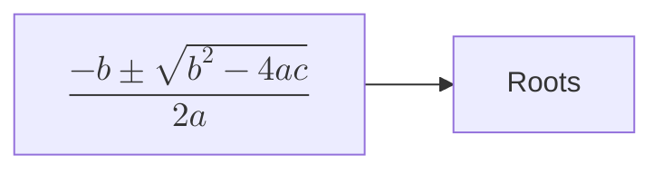

# Mathematics in diagram labels

## What this is

Kvit Notes renders Mermaid diagrams natively. A ```` ```mermaid ```` fence is
parsed into an abstract syntax tree, laid out into a resolution-independent
`Diagram::Scene` of shapes, paths and text, and painted with `QPainter` onto a
`QQuickPaintedItem` on screen and onto a raster for PDF and image export.
Nothing in that pipeline runs a browser or a JavaScript engine.

Separately, the application renders LaTeX through a vendored MicroTeX engine,
reached only through the `MathRenderer` seam in `src/content/mathrenderer.h`.
Inline `$…$` spans in prose and `$$` display blocks both go through it.

The two meet in one place. A label that is entirely a `$$…$$` span is typeset
through MicroTeX rather than drawn as its own source, so `A["$$\frac{a}{b}$$"]`
inside a flowchart shows the fraction, on screen and in every export that goes
through the native renderer.

This document describes how that works: the syntax accepted and why it matches
Mermaid's, how a formula is measured and given room in a layout built for text,
what happens when a formula fails to compile, and where the current rule stops.
"What is implemented" near the end names the files.

The reader is assumed to know the codebase layout but not this corner of it;
every file and line referenced below is named.

## What "math in a diagram" means

Mermaid itself settled this question upstream, and matching it is the whole of
the syntax design. Since Mermaid v10.9.0 a label may contain a LaTeX expression
delimited by `$$`:



Mermaid supports this in flowchart node labels, flowchart edge labels, and
sequence-diagram participant names, messages and notes. It does not support it
in class, state or entity-relationship diagrams. This specification adopts both
the delimiter and that supported set, so a diagram written for Kvit renders the
same way in any other Mermaid host and vice versa.

The delimiter choice matters for a reason beyond portability. A single `$` is
ordinary text in a diagram label, where currency amounts and shell variables
appear routinely. Requiring the doubled form keeps every existing diagram
rendering exactly as it does today.

## Which output path typesets, and which delegates

HTML export typesets nothing itself. The browser branch at
`src/application/documentexporter.cpp:615` emits `<pre class="mermaid">` around
the original source, so `$$…$$` reaches Mermaid.js unaltered; the pinned version
is 11.16.0 (`src/application/documentexporter.cpp:89`), well past the 10.9.0
release that added math, and Mermaid renders expressions as MathML by default,
which needs no additional stylesheet.

The native renderer does the typesetting: the on-screen diagram, and the raster
that PDF and PNG export embed. Both consume a `Diagram::Scene` and both paint it
through the same function, so they are one path rather than two.

## Design

### Recognising a math label

A label is treated as mathematics when, after the existing normalisation in
`labelLines()` (`src/content/diagrams/diagramlayout.cpp:90`, which turns `<br>`
and `\n` into real line breaks) and after trimming, the entire label is one
`$$…$$` span with non-blank content.

Anything else is text, including a label that merely contains a `$$` span among
other words. That restriction is the central scope decision and is justified in
its own section below.

### Scene model

`Diagram::Text` (`src/content/diagrams/diagramscene.h:94`) gains one field:

```cpp
    // TeX source when this label is a single math expression, empty
    // otherwise. Layout has already sized `rect` from the rendered metrics,
    // so the painter typesets this instead of drawing `text`.
    QString tex;
```

`text` continues to hold the raw label. Keeping both means the painter has a
fallback when an expression fails to parse, and accessibility and search have
something readable to work with.

No other scene structure changes. `Scene` stays a plain value type with no
knowledge of MicroTeX, which is what lets the same scene paint to a widget, to
a raster and to a PDF.

### Measurement

Layout sizes a node box from its label, so a math label has to be measured
before the box exists. `src/content/diagrams/diagramtext.h` provides three
functions:

```cpp
namespace Diagram {

// The TeX inside a label that is one whole `$$…$$` expression, or an empty
// string for every other label.
QString mathLabel(const QString &label);

// The pixel size mathematics should be set at beside text in `font`.
int mathLabelPixelSize(const QFont &font);

// The rendered size of `tex` at that size. An invalid size means the
// expression does not parse.
QSizeF mathLabelSize(const QString &tex, const QFont &font);

} // namespace Diagram
```

Deliberately absent is any function that measures a label which is *not*
mathematics. An earlier draft of this document proposed one `measureLabel`
returning either kind, and that would have been a mistake: the families do not
agree on how text is measured, and they are each right for their own painter.
A flowchart node label honours `<br>` because its `Text` carries the
normalized string, while a flowchart edge label does not because its `Text`
carries the raw one. Routing both through a single text measurement would have
silently resized every diagram in every existing note. Keeping the helper
math-only means each call site's text path is untouched by construction rather
than by careful reimplementation, which is why the whole existing diagram test
suite passed unchanged on the first run.

Each call site therefore reads:

```cpp
const QString tex = mathLabel(label);
const QSizeF mathSize = mathLabelSize(tex, font);
if (mathSize.isValid()) { /* use it */ } else { /* the existing text path */ }
```

The sites are few, because each family's supported labels already funnel
through a small number of places:

| Site | What it measures |
|---|---|
| `diagramlayout.cpp:335` | flowchart node label |
| `diagramlayout.cpp:596` | flowchart edge label |
| `sequencelayout.cpp:130` | the `labelW` / `labelH` / `noteW` lambdas, covering sequence participants, messages and notes |

The sixteen other `horizontalAdvance` calls across `classlayout.cpp`,
`erlayout.cpp`, `statelayout.cpp` and the sequence fragment chip measure class
members, entity attributes, state names, cardinalities and block keywords.
Mermaid supports no mathematics in any of them, so they are untouched.

### Vertical room in a sequence row

A sequence diagram stacks rows down a running cursor, and a message's arrow is
placed below its label at `cursor + labelHeight + 5`. That height has to be the
label's real height or the arrow is drawn through the label. Measuring it as
text while typesetting it as mathematics put a two-level integral straight
across its own arrow, which is the one layout defect this feature introduced
and the reason `sequencelayout.cpp:406` asks `labelH` rather than `textH`.

The same applies horizontally to a self-message, whose loop has to clear its
label, and to a note, which wraps its text at 260 logical pixels but cannot
wrap a formula and so takes the width the formula needs.

### Sizing

The math pixel size is `MathRenderer::opticalMathPixelSize()` applied to the
family's label font. That function matches the math font's x-height to the text
font's, which is what already keeps inline math in prose optically consistent
with the words around it. Using it here means a formula in one node and a word
in the next node look like they belong to the same drawing.

`MathRenderer::measure()` returns width, height, ascent and descent in logical
pixels at that size. `measureLabel` reports the width and height directly as
the label's size, and the existing per-family padding then produces the box.

Expressions are laid out in display style. A diagram label is a standalone
expression rather than part of a running sentence, so large operators and
full-height fractions are the right proportions, and it matches how Mermaid
presents the same source. This is a single boolean argument and can be revisited
per role if edge labels prove too tall in practice.

### Painting

`paintScene` has exactly one text branch, at
`src/content/diagrams/diagrampainter.cpp:380`:

```cpp
painter->drawText(t.rect, t.align | Qt::TextWordWrap, t.text);
```

It becomes a two-way branch: when `t.tex` is non-empty, call
`MathRenderer::paint()` with the painter, the TeX, the derived pixel size, and
the colour already resolved from the role by `roleColor(t.role, colors)`.
Otherwise draw the text as now. The formula is centred in `t.rect`, which
layout sized to fit it.

Two properties of that call are worth stating, because they remove work that
would otherwise be needed. First, `MathRenderer::paint()` draws glyph outlines
as painter paths rather than rasterising, so output is resolution-independent:
crisp on a scaled display at any device pixel ratio, and vector-quality in PDF,
with no image provider, no bitmap cache and no device-pixel-ratio plumbing.
Second, painting is the only place the theme is known, and it already resolves
label colour per role, so a math label follows the active theme and the export
palette exactly as a text label does.

Because PDF and PNG export reach the same function through
`DocumentExporter::dataUriForMermaid`, this single branch covers screen and
both export targets.

### Failure, limits and accessibility

An expression that does not parse falls back to its source. `measureLabel`
reports the metrics of the raw label text, and the painter draws that text,
which keeps the standing rule for mathematics in this application: show the
source and never show nothing. A blank expression is not an error and yields an
empty label.

`kMaxTexChars` in `src/content/diagrams/diagrambudget.h` already bounds a single
expression at 8192 characters, and `MathRenderer::measure()` enforces it.
Measurement is memoised process-wide, keyed by expression and size, so a
diagram containing the same formula in several nodes, or one that re-lays out on
every resize, pays for each distinct expression once.

Accessibility metadata is unchanged. `scene.summary` and the per-node
identifiers keep the raw label text including its delimiters, which is the only
textual form of an expression that exists.

## Scope

In scope: whole-label mathematics, in flowchart node labels, flowchart edge
labels, and sequence-diagram participants, messages and notes.

Out of scope, deliberately:

**Mixed text and mathematics in one label**, such as `A["Step $$x^2$$ done"]`.
This is a materially larger piece of work rather than a slightly larger one.
The painter currently hands a whole label to `QPainter::drawText` with
`Qt::TextWordWrap` and lets Qt break the lines. A mixed label has no single
font, so nothing in Qt can lay it out; the scene would need a run list, layout
would need to measure runs and break lines itself, and the painter would need to
walk runs and place each on a computed baseline. That is a small text-shaping
engine. It is a reasonable follow-up once whole-label math is in place, and the
`tex` field generalises to a run list without disturbing the families that never
use one.

**Class, state and entity-relationship diagrams.** Mermaid does not support
mathematics in them either, so a diagram using it would not render anywhere
else.

**The ASCII text-diagram renderer** in `textcanvas.cpp`, which composes
character cells. A typeset formula has no representation there.

## What is implemented

- `src/content/diagrams/diagramtext.h` and `.cpp`: recognition, sizing and the
  optical size shared by layout and painting.
- `Diagram::Text::tex` in `diagramscene.h`, carried beside `text`. The source
  stays in `text` for the fallback, for accessibility and for search.
- Flowchart node and edge labels in `diagramlayout.cpp`.
- Sequence participants, messages and notes in `sequencelayout.cpp`, including
  the row and column room a formula needs.
- The painter branch in `diagrampainter.cpp`, which serves the on-screen
  canvas, the PNG export and the PDF raster alike.

## Testing

The suites that constrain this work are `test_diagramlayout`,
`test_mermaidsequence`, `test_mermaidparser` and `test_documentexporter`.
Layout tests assert node geometry, so any change to how a non-math label is
measured surfaces there at once. All of them passed unchanged, which is the
evidence that the text paths were left alone.

Added to `test_diagramlayout`:

- `mathLabelRecognizesWholeLabelsOnly` pins the recognition rule, including
  that `costs $5 and $6`, `$PATH`, `Step $$x^2$$ done` and `$$a$$ $$b$$` are
  all text.
- `unparseableMathFallsBackToItsSource` checks that an unmatched brace yields
  no size and that such a node reaches the scene carrying its source and no
  expression.
- `flowchartTypesetsMathNodeAndEdgeLabels` checks that the expression reaches
  the scene, that the source stays beside it, that a plain label carries none,
  and that a fraction makes its node taller than a word does.
- `sequenceTypesetsMessageParticipantAndNote` checks the three supported
  sequence label kinds, and that a diagram title is left as text even when it
  looks like an expression.
- `painterTypesetsRatherThanDrawingTheSource` paints the same scene twice, once
  as built and once with the expressions cleared, and requires the two images
  to differ. That is the assertion that the painter's math branch is reached
  and produces something other than the `$$…$$` source.

## Known limits

An autonumbered sequence message is not typeset. Mermaid's `autonumber` turns
`$$x$$` into `1. $$x$$`, which is a mixed label and therefore text by the rule
above. Measurement and painting agree about it, so the result is correct rather
than broken, but it is a surprise worth knowing.

Display style is used for every label, including edge labels, which are set one
pixel below the body size and sit on a small chip. A large operator there is
tall. Changing this means selecting the style by role in both `mathLabelSize`
and the painter, which is a one-line change in each since both already have the
role in hand.

A diagram with no math label measures and renders exactly as it did before any
of this existed, because the shared helper never took over plain-text
measurement. The measurement section explains why it was left alone.
