# Kvit Notes: a feature gallery

Kvit Notes is a markdown block editor written in C++ and Qt. Your notes are
ordinary `.md` files in an ordinary folder; the application renders them as
you write and puts the result back on disk as markdown a person can read.

Every clip below is the real application, recorded unattended by a scripted
launcher that composes the shipped window and drives it with real key and
pointer events (`tools/uidriver.cpp`, `tools/record-gallery.sh`). Nothing is
mocked up and nothing is edited afterwards; each clip plays at twice the
speed it was captured at, which is the only change made at assembly time.

Each section explains what is happening well enough to stand without the
picture. If you want the specification rather than the tour, read
[features.md](features.md); if you want to know how to drive it, read
[usage.md](usage.md).

---

## Drag a node, and the markdown rewrites itself

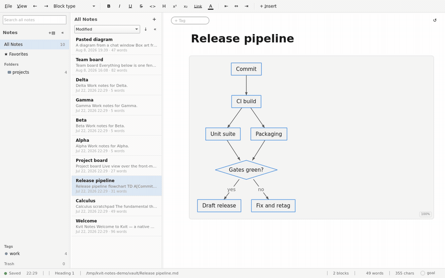

A ` ```mermaid ` fence is parsed and laid out in C++, with no browser engine
and no image export step, and the drawing it produces is editable. The clip
opens the fence to show the eight lines of Mermaid source, closes it, drags the
`Commit` node to a new place, and opens the fence again: a
`%% mermaid-flow:pos` comment now sits at the end of it, holding the
coordinates of every node. Because the position lives in a comment, the fence
is still valid Mermaid everywhere else, and a diagram you have arranged by
hand keeps its arrangement in git.

## Markdown syntax reveals itself around the caret


The paragraph is stored as markdown and shown rendered. The asterisks around
**bold**, the backticks around `code` and the dollars around a formula are
hidden until the caret moves inside the span they belong to, and they come
back the moment it does, so you edit the real syntax without reading it.
Watch the caret step into each of the four spans in turn. This is one editing
mode rather than two: there is no preview pane to switch to and nothing to
toggle.

## TeX math, rendered as you type

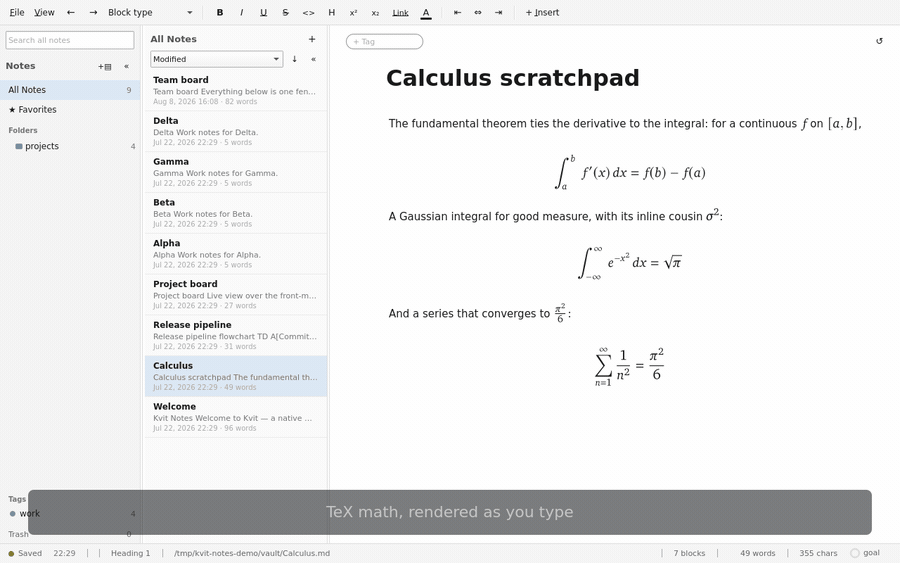

`$e^{i\pi} + 1 = 0$` is typed into a paragraph and set as a formula as soon as
it closes. Math is rendered by a vendored MicroTeX with the NewTX and XCharter
faces, in the same process as everything else, so a formula appears at typing
speed rather than after a round trip to a server. Inline formulas sit on the
text's own baseline at the size of the prose around them; `$$…$$` on its own
lines makes a centred display equation instead.

## Type `/` and choose what the block becomes

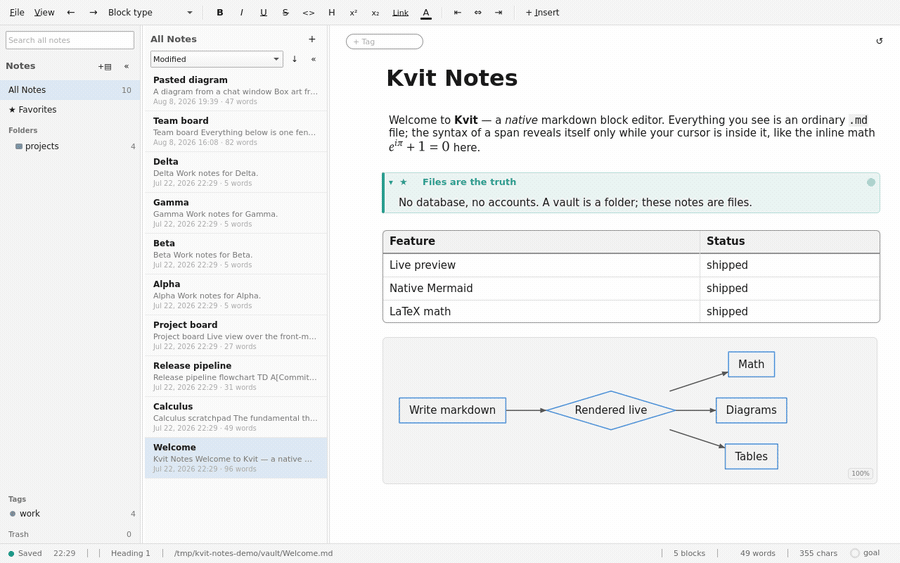

Every block kind the editor has is reachable from one menu. Typing `/` on an
empty block opens the catalogue grouped by kind; typing further letters
filters it; Enter converts the block. The clip picks the to-do item, types a
task into it and ticks the box. Nothing here is a special object: the result
is a `- [x]` line in the markdown file, which is why a note built this way
still reads correctly in any other editor.

## A markdown table, edited like a grid

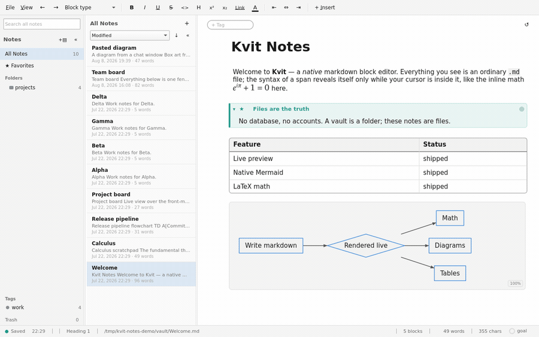

A GitHub-flavoured markdown table is drawn as a grid and edited in place.
Clicking a cell opens an editor on that cell alone; Tab walks across the row
and continues onto the next one; the `+ Row` and `+ Column` chips appear only
while a cell is being edited, so a table you are only reading stays clean. The
file underneath keeps its pipe-and-dash form throughout.

## A board whose cards are list items in the file

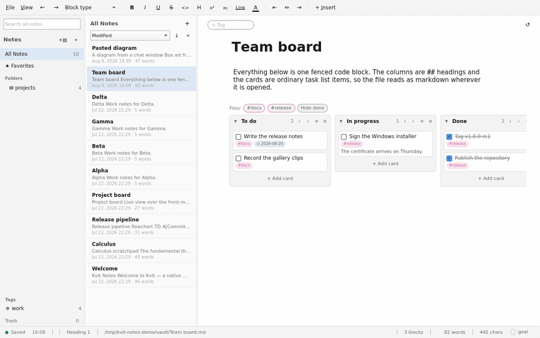

A ` ```kanban ` fence is drawn as a board. Its columns are `##` headings and
its cards are `- [ ]` task items, with `#labels` and a `📅 date` written the way
a person would write them, so the board is legible as plain markdown. Every
gesture on it rewrites those lines as a single undo step, whether that is
carrying a card to another column, ticking one off, adding a card, renaming a
column or reordering them. The clip moves one card between columns and
finishes another.

## A live table built from front matter across the vault

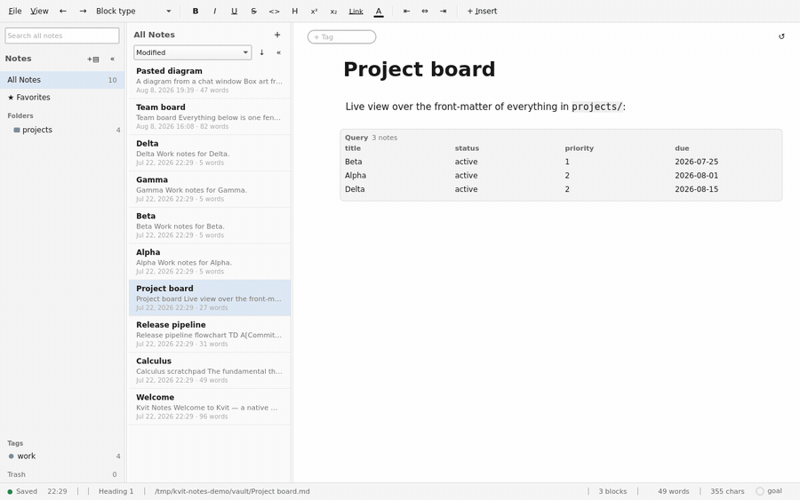

A ` ```query ` fence is a saved question about the vault's front matter: which
folder to read, which notes to keep, which fields to show, how to sort them.
The clip opens the block to show that specification above the table it
produced. A separate process then edits one project's `status:` from `done` to
`active` on disk, which is exactly what an edit from a script or another
editor looks like, and the row appears without anything being clicked. Query
blocks can render as a table, or as a board grouped by one of the fields.

## Link notes by name, and see what links back


Typing `[[` opens a picker over every note in the vault, filtered as you type;
choosing a row writes the finished `[[Beta]]` link. Clicking a rendered link
opens that note. The View menu's Backlinks pane then answers the question from
the other side: which notes point at the one that is open, and the line each
link appears on. Backlinks are read from the files themselves, so a link
written by any other tool counts.

## Find in the note, then across every note

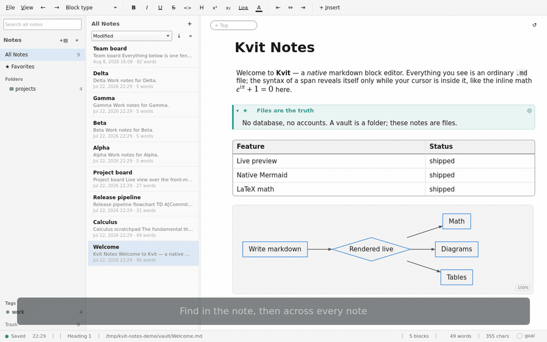

Ctrl+F searches the open note, tinting every match and stepping between them,
with case, whole-word and regular-expression switches beside the field. The
sidebar's search field asks the same question of the whole collection: results
come back grouped by note with the matching line under each, and choosing one
opens that note scrolled to the match, with the find bar already holding the
query. The collection index is built in-process; there is no external search
service.

## One choice repaints the whole window

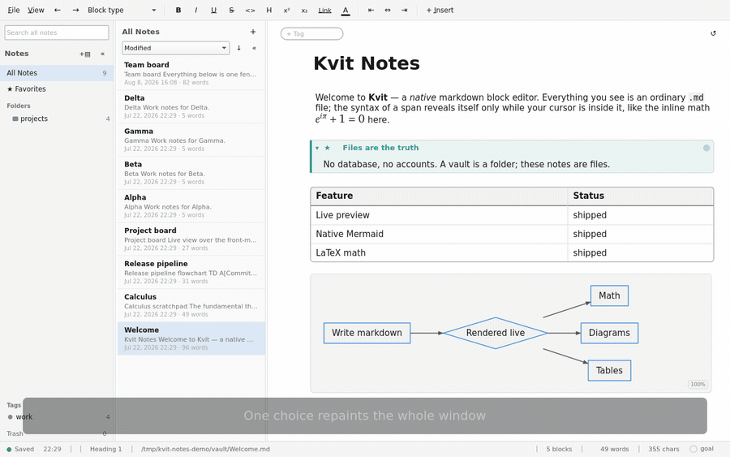

Light, dark, sepia and a high-contrast theme, plus one that follows the
desktop. A theme is not a stylesheet over the document alone: the toolbar, the
folder tree, the note list, the status bar, the syntax highlighting in code
blocks and the colours a diagram is drawn with all change together, which is
what the clip is showing as it cycles through three of them.

## Copy any diagram out as text

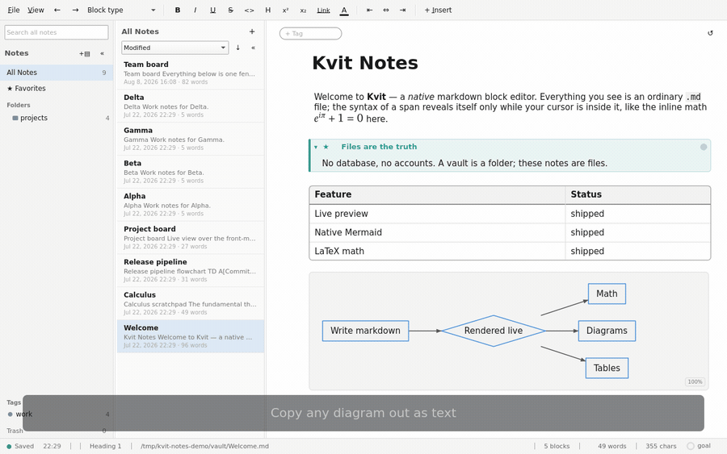

Any diagram the application drew can be copied out as box-drawing characters,
for a commit message, a code comment, a terminal, or anywhere a picture cannot
go. The clip hovers the rendered flowchart, clicks **Copy as text**, and pastes
the result into a code block directly underneath, so the drawing and its text
version are on screen together.

The caret is deliberately left in that code block. Box-drawing characters are
also how Kvit recognises a diagram, so the pasted block renders as a second
drawing as soon as it stops being edited, and holding it open is what keeps
the characters themselves visible. What the text export still leaves out is
listed in [docs/backlog.md](docs/backlog.md) under "What Copy as text still
leaves out".

## Export a note to PDF, HTML, markdown or text

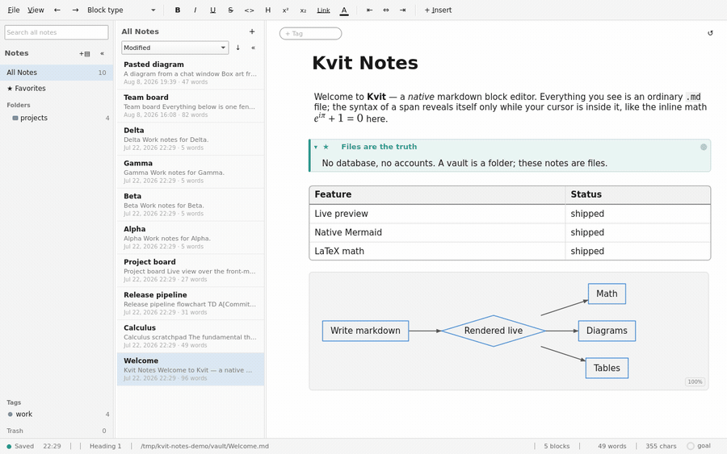

Export takes one note, the notes selected in the note list, or the whole
collection, and writes markdown, a self-contained HTML file, a PDF, or plain
text. The PDF is printed from the same rendering the editor shows, so
formulas, diagrams and tables come out as they look on screen. The clip
exports the open note to PDF and ends on the status bar naming the file.

## Open a single file with no vault around it

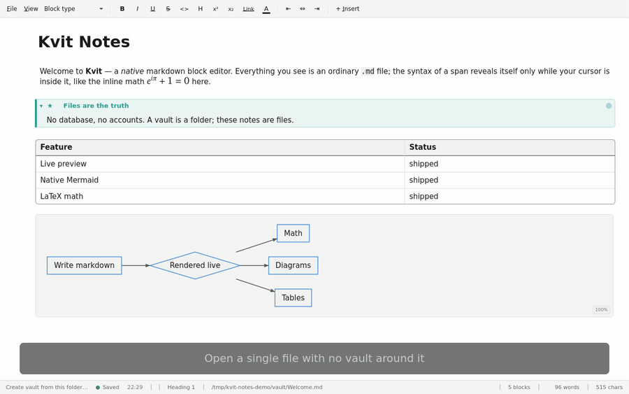

`kvit-notes note.md` opens that one file with the whole editor intact and
none of the collection chrome: no folder tree, no note list, just the document
across the width of the window and its path in the status bar. Saving writes
that file and nothing else. It is the mode for opening a README from a
terminal, and the status bar offers to make a vault out of the surrounding
folder if you decide you want one.

---

## Recording these yourself

```bash
cmake -S . -B build -DKVIT_UI_DRIVER=ON
cmake --build build --target kvit-uidriver -j 8
tools/record-gallery.sh              # every clip, into screenshots/gallery/
tools/record-gallery.sh kanban       # or just one
```

The clips are captured at 1280×800 and published 900 pixels wide, from the
demo vault checked in at `screenshots/demo-vault/` plus the extra notes in
`screenshots/demo-vault-gallery/`. The vault is staged at a fixed path under
`/tmp` for every run, because the status bar renders the open note's absolute
path and a capture made from a home directory would put a username into its
pixels; `tools/check-image-leaks.sh` reads sampled frames of every committed
clip as a backstop against exactly that.

## What is not here

Two things were tried and left out rather than shipped as something
confusing to watch.

**Diagram repair on paste.** Pasted ASCII box art is straightened as it is
ingested, but the repair is deliberately conservative. Every fix is a
zero-shift edit, such as a wall character swapped for a space or a corner
extended through fill; label text is never touched, and anything the rules
cannot fix cleanly is left exactly as written. Against three kinds of ragged input it
padded one line by a single space, declined to touch the second, and could not
fix the third. There is no before-and-after that a viewer could see at this
size. The feature is real and is specified in
[features.md](features.md); it just does not film.

**Anything requiring a second application.** The export clip ends at the
status bar rather than in a PDF viewer, and the single-file clip shows the
file's path rather than a file manager, because the recording runs in a
headless session with nothing else installed in it.
