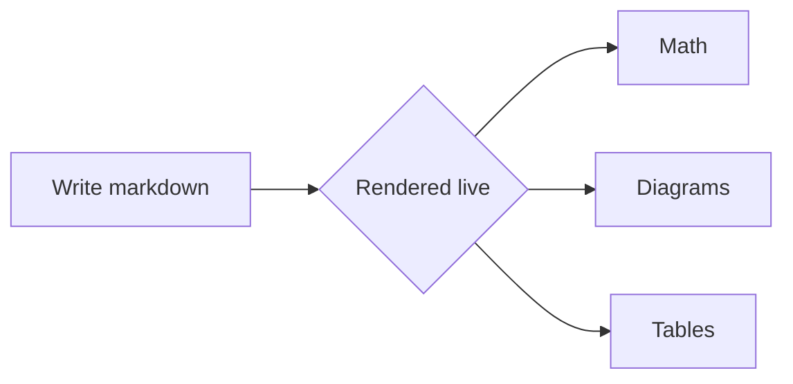

# Kvit Notes

Welcome to **Kvit** — a *native* markdown block editor. Everything you see is an ordinary `.md` file; the syntax of a span reveals itself only while your cursor is inside it, like the inline math $e^{i\pi}+1=0$ here.

> [!tip] Files are the truth
> No database, no accounts. A vault is a folder; these notes are files.

| Feature | Status |
| --- | --- |
| Live preview | shipped |
| Native Mermaid | shipped |
| LaTeX math | shipped |

